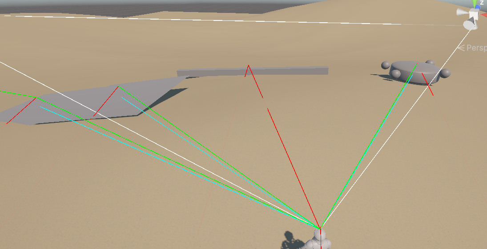
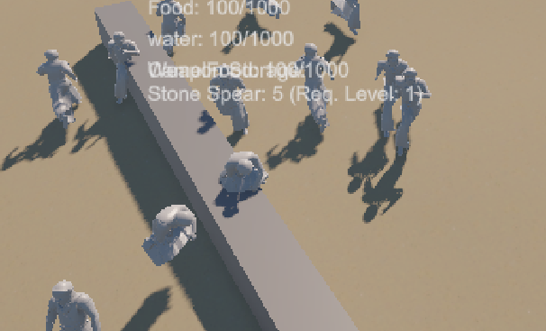

# Autonomous AI & RTS Command Engine | Tactical Decision Backend

  
  

A high-performance, modular Artificial Intelligence backend designed for strategy games. This architecture utilizes a hybrid control system, allowing characters to operate via autonomous swarm-logic or instantly submit to direct player overrides via an RTS-style camera and group-selection interface. It is aggressively optimized to handle dozens of active agents simultaneously without bottlenecking the main CPU thread.

## 🧠 Core Architecture & Modules

### 1. Hybrid RTS Command System (Player Override)
The engine seamlessly blends autonomous behavior with direct player control, utilizing classic Real-Time Strategy mechanics.
* **RTS Camera & Raycasting:** Features a detached, tactical camera that uses screen-to-world raycasting to interpret player clicks on the NavMesh.
* **Swarm Grouping & Ordering:** Players can box-select multiple units to form temporary squads. When an order is issued, the system overrides the units' autonomous "Brains" and forces them to pathfind and execute the player's target task in unison.

### 2. The Sensory & "Snoop" System (Eyes and Metaphorical Ears)
When not under direct player control, the AI only reacts to what it can physically perceive within its environment and communicate with nearby allies.
* **Visual Cone (TribeVisionSensor):** Utilizes optimized sphere-casts and dot-product calculations to create a realistic field of view. It detects hostiles, resources, and obstacles only if line-of-sight is unbroken.
* **Ally Interrogation (The "Snoop" System):** The AI "listens" to its team by snooping on the states of nearby mates. An agent reads a close ally's `currentTask` integer and can dynamically override its own idle/wander state to sync up and assist (e.g., helping a teammate gather). This creates organic, emergent squad behavior without requiring a centralized Manager script.

### 3. Precision Combat Foundation (High-Performance)
The combat system is currently in its foundational stage (unarmed base strikes), but the underlying architecture is designed strictly for massive scalability.
* **Stateless Hit Detection (`WeaponHitDetector`):** Instead of relying on standard Unity collision physics (which causes heavy CPU load when dozens of units fight), combat uses a custom, lightweight trigger script. 
* **Frame-Safe Execution:** It calculates damage and enforces a strict `hitCooldown` using `Time.time` to prevent frame-tied multi-hit bugs, allowing massive brawls to occur without dropping frames.

### 4. Aggressive Optimization & Execution
The backend is built from the ground up to maintain high frame rates even when the screen is filled with active agents.
* **Asynchronous Brain Ticks:** Instead of running complex distance calculations and sensory scans inside the `Update()` loop every single frame, the "Brain" logic is throttled using custom timers (e.g., `scanTimer`). It only processes heavy logic every few milliseconds.
* **Smart Ground Snapping:** Replaces expensive physics-based gravity with a lightweight downward Raycast to keep the character perfectly snapped to the terrain (`SnapToGround`), saving massive amounts of Rigidbody computation.
* **Stuck Mitigation:** If the `stuckTimer` detects no meaningful movement over a set period, the AI automatically recalculates the path or abandons the current micro-task to prevent NavMesh soft-locks, ensuring continuous flow.

---

## ⚙️ Data Flow & Decision Pipeline

Every active tick, the AI follows a strict evaluation hierarchy:

1. **Player Override:** Has the player selected this unit and issued a direct RTS command? If yes, execute immediately.
2. **Sensory Polling:** If autonomous, update visual targets using the `TribeVisionSensor`.
3. **State Override & Snoop Check:** Check nearby allies' tasks. Is a teammate gathering or in combat? Sync tasks to assist. 
4. **Task Execution:** Proceed with `currentTask` logic (Pathfinding via NavMesh to `targetPosition`).
5. **Action Cooldowns:** Execute physical actions based on strict timer cooldowns rather than spamming logic on every frame.

## 🚀 Integration Guide

1. Attach the core `TribeMember` controller script to your humanoid prefab.
2. Ensure the prefab has a defined `TribeVisionSensor` child object placed at head-height to act as the visual origin point.
3. Assign the `WeaponHitDetector` to the character's hand to enable the high-performance combat tracking.
4. Integrate with the RTS Camera Manager to allow for box-selection and NavMesh command targeting.
